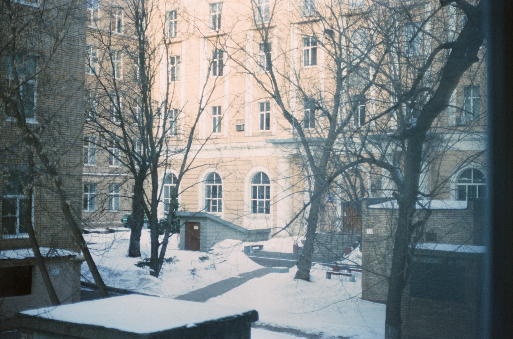

# Невидимый Басмач

«Невидимый Басмач» – это (пост)документальная спектакль-прогулка по учебному корпусу «Высшей школы экономики» на Старой Басманной 21/4 в Москве, который поставили его студентки и студенты в 2022/2023 учебном году. Осенью 2023 проект получил электронную форму в виде бота-экскурсовода в Telegram.  

Это [исходный код](bot.py) бота на Pythonanywhere. Подробный урок по выкладке бота в сеть можно найти [здесь](https://github.com/elmiram/2016learnpython/blob/master/TelegramBot1.ipynb). 

[Бот](https://t.me/invisible_basmach_bot) | [Страница проекта](https://t.me/invisible_basmach) 

**Команда спектакля:**

• Антонина Морозова (сценарий)  
• Леонид Болховский (саунд-дизайн)  
• Анастасия Панасюк (бот)  
• Александра Хвостова  
• Алевтина Намёткина  
• Елизавета Иванова  
• Митя Лобанов  
• Диана Габитова  

В спектакле использованы фотографии Фёдора Рощина и трек «Menysid» (Nicolas Jaar).
